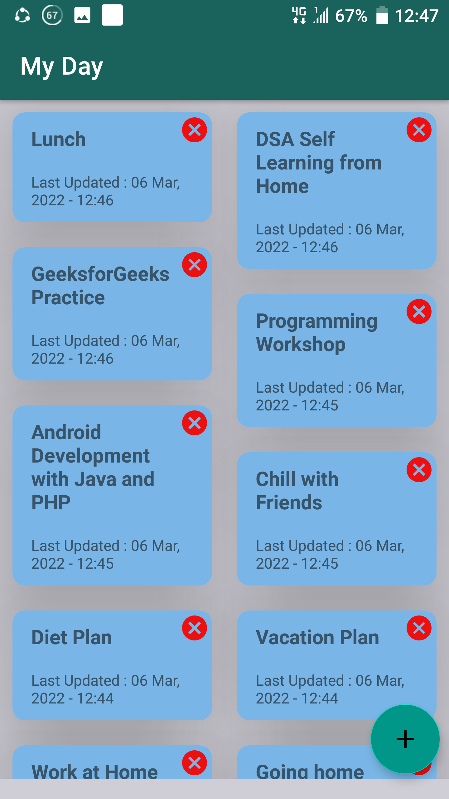
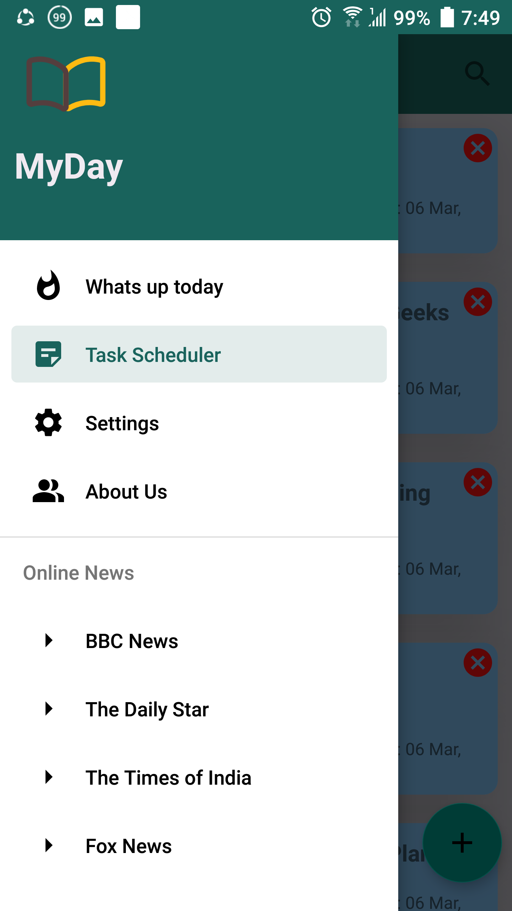

# Project Description

Here, an user can set his goals by adding list of to-do tasks.
He/she can update his regular task list and delete if needed.
Besides, all the tasks are added and updated instantly in RecyclerView with recent data and time using LiveData and Kotlin coroutines.
The project is built with Kotlin following the MVVM architecture. Besides, the Room database is used for storing user data.

### Languages: 
Kotlin
### Databases:
Room
### Tools and Technologies: 
Android Studio

## Screenshots:
   
   

## Topics:
1.Splash Screen with Threading  
2. RecyclerView  
3. CardView  
4. Adapter  
5. MVVM architecture  
6. Repository   
7. Kotlin Coroutine  
8. Live Data  
9. Room Database  
10. Material UI Components
