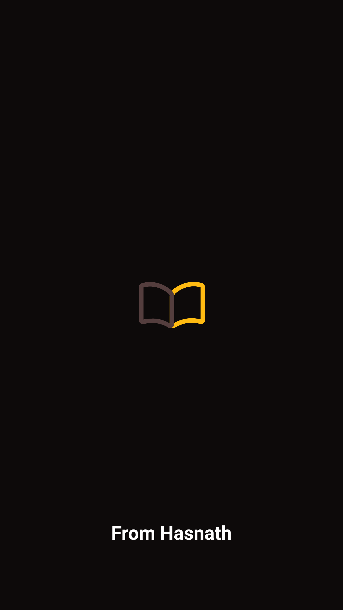
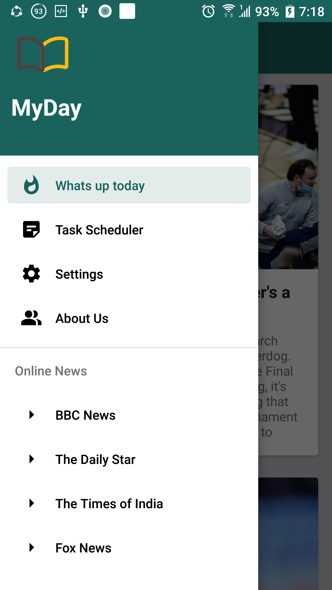

# Project Description

My-Day is an **android app** about setting goals and task scheduling and current world news system. Here, a user can set his goals by adding list of to-do tasks.
He/she can update his regular task list and delete if needed. He/She can also search his regular task through keywords.
Besides, all the tasks are added and updated instantly in RecyclerView with recent data and time using LiveData and Kotlin coroutines.
A user can see the current world news data which is feching through API call. At last, he/she can read several types of online news paper through Web View.
The project is built with Kotlin following the MVVM architecture. Besides, the Room database is used for storing user data and volley library is used in API call.

## Features:
1. To-do Task List System
2. Adding New Task System
3. Deleting Task from Task List System
4. Realtime Task Updating System with Recent Data and Time
5. Task Searching System
6. Current News Data Through API CALL
7. Read Famous Online News Paper Through Web View

### Languages: 
Kotlin
### Databases:
Room
### Tools and Technologies: 
Android Studio

## Project Demo:

### Splash Screen:
 

  

## Topics:
1.Splash Screen with Threading  
2. RecyclerView  
3. CardView  
4. Adapter  
5. MVVM architecture  
6. Repository   
7. Kotlin Coroutine  
8. Live Data  
9. Room Database  
10. Material UI Components  
11. Volley  
12. Glide  
13. WebView  
